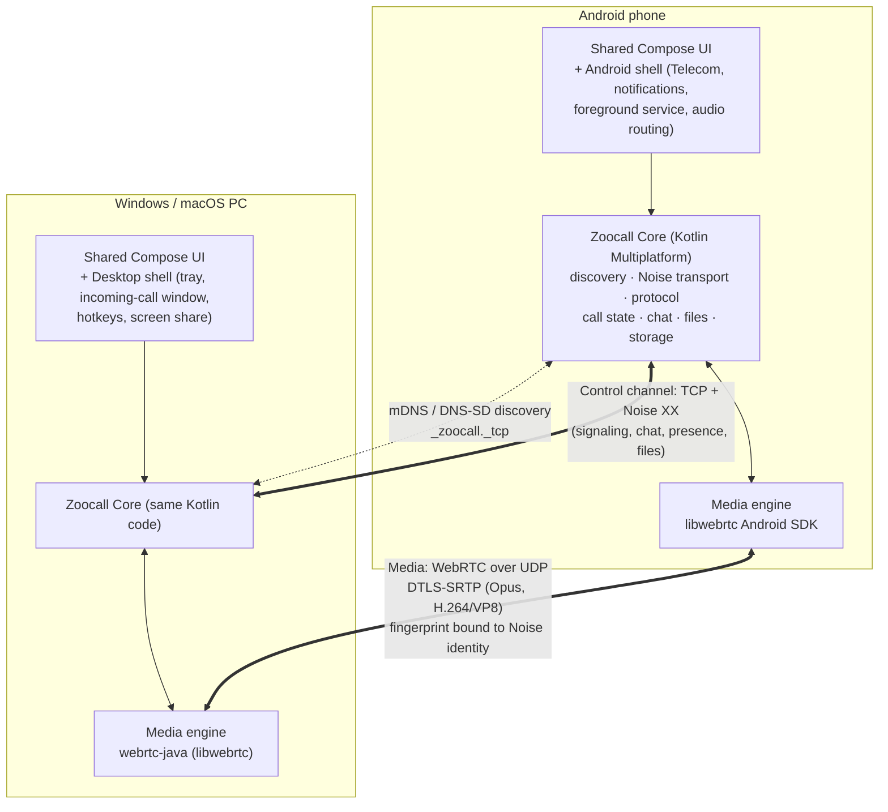

# Zoocall — Final Plan

> **Status:** Approved plan, pre-implementation · **Last updated:** 2026-09-13 (rev. 2: Android + Desktop first, Windows dev machine) · **License:** MIT · **Price:** Free forever, fully open source

This is the main planning document. It covers the goal, the scope and the key decisions, and links to the detailed documents.

---

## 1. The goal in one sentence

**Zoocall lets people on the same Wi-Fi network call, video call and message each other with no internet, no accounts, no servers and no cost. Every call is end-to-end encrypted. It launches on Android, Windows and macOS first, with iOS and Linux later.**

Think of it as a **secure team intercom and phone for a local network**: an office, a school, a warehouse, a hospital floor, a home, a film set, a ship, or a phone hotspot in the field.

## 2. Platform priority (rev. 2)

| Order | Platform | Built | Tested by owner | Status target |
|---|---|---|---|---|
| **1** | **Android** (phones, tablets, foldables) | From day one | **Android ↔ Android** on real phones | Complete v1.0 feature set |
| **1** | **Desktop: Windows** | From day one, in parallel with Android (same Kotlin code) | **Android ↔ Windows PC** | Complete v1.0 feature set |
| **1** | **Desktop: macOS** | From day one (same desktop app), packaged by CI | **Android ↔ Mac** when a Mac with free storage is available | Complete v1.0 feature set |
| 2 | Desktop: Linux | Builds from the same desktop app at almost no cost | Community tested | Official support after v1.0 |
| 3 | **iOS / iPadOS** | **Later**, after Android + Desktop v1.0 | — | Planned in v2 |

- **Development machine:** Windows PC. The Mac is not used for day-to-day development because its disk is full. See [11-dev-environment-windows.md](11-dev-environment-windows.md).
- **"Build everything at the same time"** means Android and Desktop share one Kotlin codebase, so every feature lands on both at once. The owner's testing focus is **Android ↔ Android** and **Android ↔ PC**.

## 3. Why Zoocall exists

| Problem | Zoocall answer |
|---|---|
| Normal calling apps need internet and accounts, and they send data through cloud servers | Everything is peer-to-peer inside the LAN. Nothing leaves the network |
| Internet may be down, slow, expensive or banned, but the Wi-Fi router still works | Only a local network is needed (a router or a phone hotspot) |
| Enterprise intercom/VoIP systems (PBX, SIP) are complex to set up | Install, type your name, done. Other people show up automatically |
| Privacy concerns | E2E encryption, no telemetry, no accounts, open source and auditable |
| Apps usually cost money or show ads | Free, MIT-licensed, no payments, no ads, no tracking |

## 4. Guiding principles

1. **Simple over clever.** Every feature must be usable with zero explanation. If a feature needs a tutorial, redesign it or cut it.
2. **Local-first and serverless.** No central server is ever *required*.
3. **Secure by default.** Encryption is always on and cannot be turned off. Identity is a cryptographic key, not a name.
4. **One language, one codebase where possible.** Kotlin Multiplatform shares logic *and* UI across Android and Desktop, which keeps the team small and features in sync.
5. **One protocol, many clients.** The protocol is specified, versioned and tested, so a future iOS client (or a third-party client) can interoperate.
6. **Accessible and inclusive.** WCAG 2.2 AA, screen readers, dynamic text, captions, RTL and localization from day one.
7. **No over-engineering.** Build the smallest thing that works, then grow it.

## 5. Scope

### In scope (v1.0 on Android + Desktop)
- Automatic discovery of Zoocall users on the same network (plus QR code and manual IP as fallbacks)
- 1:1 **audio calls** and **video calls**
- Small **group calls** (audio up to 8 people, video up to 4 in mesh)
- **Text messaging**, photos/files, voice notes, read receipts
- **Push-to-talk (walkie-talkie)** mode for teams, and **Knock**
- **Screen sharing** from desktop
- Presence (Available / Busy / Do Not Disturb)
- Secure contact verification (safety code / QR)
- **Network Doctor**, which explains *why* peers cannot see each other
- Light / Dark / System themes, dynamic color, full accessibility

### Out of scope (non-goals)
- Calling over the internet, NAT traversal, STUN/TURN relays
- Calling real phone numbers (PSTN/SIP trunks)
- Accounts, cloud sync, cloud backup, analytics, ads, payments
- Large meetings (more than 8 people) in v1
- iOS in v1 (planned later)

## 6. Architecture at a glance



**Key technology decisions** (reasoning in [10-decisions.md](10-decisions.md)):

| Layer | Choice |
|---|---|
| Language | **Kotlin 2.x**, one language for all v1 platforms |
| Shared code | **Kotlin Multiplatform** (`androidTarget` + `jvm("desktop")`, iOS target added later) |
| UI | **Compose Multiplatform** + Material 3 Expressive, one design system for Android and Desktop |
| Discovery | **mDNS/DNS-SD** (`_zoocall._tcp.local`): Android `NsdManager`, Desktop `JmDNS`. QR code and manual IP:port as fallbacks |
| Secure channel | **Noise Protocol `Noise_XX_25519_ChaChaPoly_BLAKE2b`** over TCP (Ktor sockets), primitives from **libsodium** |
| Media | **WebRTC (Google libwebrtc)**: Android SDK on phones, **webrtc-java** on Windows/macOS. Opus, H.264/VP8, AEC/NS/AGC. LAN host candidates only |
| Media auth | DTLS fingerprints are exchanged only inside the authenticated Noise channel, so no MITM is possible on media |
| Wire format | **Protocol Buffers** (Square **Wire**), length-prefixed frames, versioned `zoocall.v1` |
| Storage | **SQLDelight** + **SQLCipher** (Android and JVM drivers) |
| Android shell | Core-Telecom, foreground services, CallStyle notifications, PiP |
| Desktop shell | Compose Desktop windows, system tray, always-on-top incoming call window, native installers (MSI, DMG) |
| iOS (later) | Same KMP core compiled for iOS + SwiftUI or Compose UI, CallKit, WebRTC.xcframework |

## 7. Monorepo layout

```
zoocall/
├── docs/                ← this plan (you are here)
├── protocol/            ← .proto schemas, protocol spec, test vectors (source of truth)
├── shared/              ← Kotlin Multiplatform modules used by Android AND Desktop
│   ├── core/            ← model, crypto, protocol, transport, discovery, call, chat, files, store
│   ├── media/           ← MediaEngine interface + Android/Desktop WebRTC implementations
│   └── ui/              ← Compose design system + all screens + view models
├── android/             ← Android app (thin shell: manifest, Telecom, services, notifications)
├── desktop/             ← Desktop app for Windows + macOS (+ Linux) (thin shell + packaging)
├── apple/               ← iOS / iPadOS app (later)
├── design/              ← design tokens, icons, brand, sounds, mockups
├── tools/               ← CLI test peer, network test lab, scripts
├── gradle/  settings.gradle.kts  build.gradle.kts  gradlew(.bat)
└── .github/             ← CI (Android, Desktop Windows/macOS/Linux), templates
```

Full details are in [08-engineering-quality.md](08-engineering-quality.md).

## 8. Detailed documents

| # | Document | What's inside |
|---|---|---|
| 01 | [Features](01-features.md) | Complete feature catalogue with priorities (P0–P3), including stand-out features |
| 02 | [Architecture](02-architecture.md) | Modules, data flow, call lifecycle, storage, concurrency |
| 03 | [Protocol](03-protocol.md) | Discovery, handshake, messages, signaling, versioning, timeouts |
| 04 | [Security & Privacy](04-security-privacy.md) | Threat model, crypto, pairing/verification, data at rest, abuse prevention |
| 05 | [UX / UI Design](05-ux-ui-design.md) | Navigation, screens, themes, icons, accessibility, motion, copy |
| 06 | [Platforms](06-platforms.md) | Android, Windows, macOS specifics. Linux and iOS later |
| 07 | [Edge Cases](07-edge-cases.md) | Network, call, device and human edge cases and how each is handled |
| 08 | [Engineering & Quality](08-engineering-quality.md) | Monorepo, CI/CD, testing, performance budgets, release, distribution |
| 09 | [Roadmap](09-roadmap.md) | Milestones, exit criteria |
| 10 | [Decisions](10-decisions.md) | Architecture decision records, alternatives considered, open questions |
| 11 | [Windows Dev Environment](11-dev-environment-windows.md) | Moving the repo to Windows, tools to install, testing with phones |

## 9. The first milestone in one paragraph

**Android ↔ Android, and Android ↔ Windows PC.** Two people on the same Wi-Fi open Zoocall, type a name and see each other in **People**. One taps the video button, and the other gets a full-screen incoming call (on the phone's lock screen, or as a pop-up window on the PC) and answers. The call is HD, encrypted, has echo cancellation, and connects in under a second. They can mute, switch camera, pick speaker or Bluetooth, and hang up. They can also send text messages. Nothing touches the internet.

## 10. Success criteria

- A first-time user can make a call within **60 seconds** of installing, with no instructions
- Call setup under **1 s** on a normal LAN, mouth-to-ear latency under **150 ms**
- Android ↔ Android, Android ↔ Windows and Android ↔ macOS calls all pass the interop checklist
- **0** network requests to the internet (verified in CI)
- WCAG 2.2 AA compliance and full screen-reader operability of all core flows
- Crash-free sessions ≥ 99.5%, verified by testers because there is no telemetry
