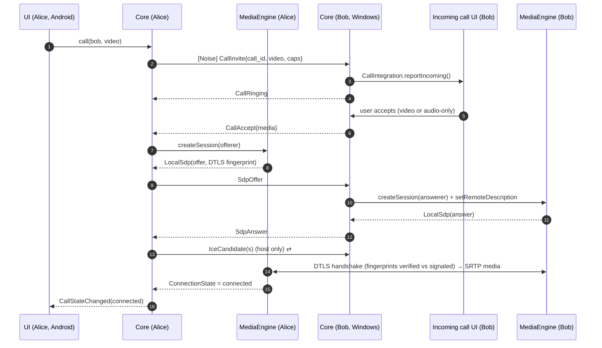
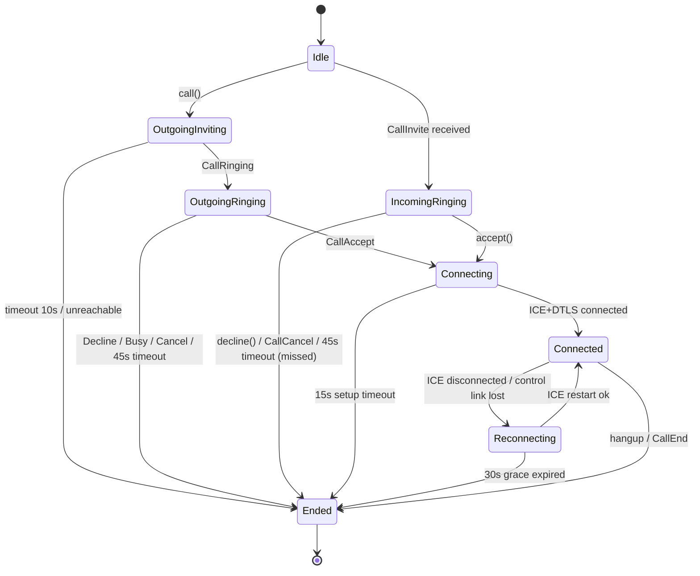

# 02 — Architecture

## 1. Architectural style

**Kotlin Multiplatform, with a shared core, shared UI and thin platform shells ("ports and adapters").**

- **`shared/core`** is pure logic plus networking. It has no UI and no Android or desktop imports in `commonMain`.
- The core defines **ports** (interfaces), and each platform implements them: key storage, discovery, media engine, audio routing, notifications, background execution.
- **`shared/ui`** contains the Compose design system, every screen and every view model. It is used by both Android and Desktop.
- **Platform shells** (`android/`, `desktop/`) are thin. They contain entry points, OS integration and adapter implementations.
- The **protocol** (in `protocol/`) is the contract between any two devices, independent of the Kotlin implementation. A future iOS client or a third-party client can interoperate with it.

```mermaid
flowchart LR
  subgraph Shells["Platform shells"]
    AND[android/<br/>Activity · Telecom · FGS · notifications]
    DSK[desktop/<br/>main() · tray · windows · hotkeys · installers]
  end
  subgraph UI["shared/ui (Compose Multiplatform)"]
    SCR[Screens + ViewModels]
    DS[Design system]
  end
  subgraph Media["shared/media"]
    MI[MediaEngine interface]
    MA[androidMain: libwebrtc Android SDK]
    MD[desktopMain: webrtc-java]
  end
  subgraph Core["shared/core (commonMain + actuals)"]
    APP[app facade / use cases]
    CALL[call]
    CHAT[chat]
    FILES[files]
    PRES[presence]
    TR[transport]
    DISC[discovery]
    CRY[crypto]
    STORE[store]
    PROTO[protocol]
  end
  AND --> SCR
  DSK --> SCR
  SCR --> APP
  SCR --> DS
  APP --> CALL & CHAT & FILES & PRES
  CALL --> MI
  MI --> MA & MD
  CALL & CHAT & FILES & PRES --> TR
  TR --> CRY & PROTO
  APP --> DISC & STORE
```

## 2. What lives where

| Concern | Where | Reason |
|---|---|---|
| Discovery logic, handshake, framing, protocol parsing | `shared/core` (common) | Security- and interop-critical. Written once, tested once |
| mDNS socket implementation | `shared/core` actuals: Android `NsdManager`, Desktop `JmDNS` | OS-specific APIs |
| Call state machine, signaling, group mesh | `shared/core` | Identical behaviour on every device |
| Chat, receipts, queueing, file transfer | `shared/core` | Same |
| Storage (contacts, messages, recents) | `shared/core` (SQLDelight) | One schema and one migration path |
| Media capture/encode/transport | `shared/media` actuals over **libwebrtc** | Battle-tested AEC/NS/jitter buffer/congestion control |
| Screens, navigation, theming, accessibility semantics | `shared/ui` | One UI codebase, adaptive to phone/tablet/desktop |
| OS call integration, notifications, background, tray | `android/`, `desktop/` | Deeply OS-specific |
| Secret key storage | Adapters: Android Keystore, Windows DPAPI / macOS Keychain | Hardware- or OS-protected keys |

## 3. Gradle modules

| Module | Targets | Responsibility | Key libraries |
|---|---|---|---|
| `:shared:core:model` | common | IDs, fingerprints, value types, errors | kotlinx-datetime |
| `:shared:core:protocol` | common | Generated protobuf types + frame codec (length-prefixed, size-capped) | Square Wire |
| `:shared:core:crypto` | common + actuals | Noise XX state machine, identity keys, fingerprints, safety codes, AEAD for files at rest | libsodium (`multiplatform-crypto-libsodium-bindings`) |
| `:shared:core:discovery` | common + android + desktop | Advertise/browse, manual peers, last-known addresses | `NsdManager`, JmDNS |
| `:shared:core:transport` | common | TCP listener, Noise handshake, connection manager, keepalive, reconnection, rate limiting | Ktor network sockets, coroutines |
| `:shared:core:call` | common | Call state machine (1:1 + mesh), signaling, collision, timeouts, PTT floor control | |
| `:shared:core:chat` | common | Messages, offline outbox, receipts, typing, reactions | |
| `:shared:core:files` | common | Chunked transfer on a secondary Noise stream, resume, hash verification | libsodium BLAKE2b (streaming) |
| `:shared:core:store` | common + drivers | SQLite schema, migrations, FTS5 search | SQLDelight, SQLCipher (`sqlcipher-android`, `sqlite-jdbc-crypt`) |
| `:shared:core:app` | common | Facade: `start()`, `call(peer, video)`, `sendMessage(...)`, `events: Flow<CoreEvent>` | Koin |
| `:shared:media` | common + android + desktop | `MediaEngine` interface and implementations, video renderers for Compose | `io.github.webrtc-sdk:android`, `dev.onvoid.webrtc:webrtc-java` |
| `:shared:ui` | common + android + desktop | Design system, screens, view models, navigation, strings | Compose Multiplatform, Navigation Compose, Lifecycle ViewModel, Coil 3 |
| `:android` | Android app | Manifest, `MainActivity`, `CallActivity`, Core-Telecom, foreground services, notifications | AndroidX |
| `:desktop` | JVM app | `main()`, windows, tray, incoming call window, hotkeys, packaging | Compose Desktop |
| `:tools:cli` | JVM app | Headless peer: discover, chat, call (tone in/out). Used in tests and debugging | Clikt |

**Rules**
- Dependencies point downward only. `protocol` and `crypto` know nothing about calls or chat.
- `commonMain` must not import `android.*` or `java.awt.*`. This keeps the path open for adding an iOS target later.

## 4. Ports (interfaces the platform implements)

```kotlin
interface SecureKeyStore {          // Android Keystore / DPAPI / macOS Keychain
    suspend fun loadIdentity(): ByteArray?
    suspend fun saveIdentity(secret: ByteArray)
    suspend fun databaseKey(): ByteArray
}

interface Discovery {               // NsdManager / JmDNS
    fun advertise(record: ServiceRecord)
    fun browse(): Flow<DiscoveryEvent>
    fun stop()
}

interface MediaEngine {             // libwebrtc Android / webrtc-java
    fun createSession(callId: CallId, peer: Fingerprint, role: Role, kind: MediaKind): MediaSession
}

interface MediaSession {
    val events: Flow<MediaEvent>    // LocalSdp, IceCandidate, ConnectionState, Stats, RemoteTrack
    suspend fun createOffer()
    suspend fun setRemoteDescription(sdp: Sdp)
    suspend fun addIceCandidate(candidate: Ice)
    fun setMicEnabled(on: Boolean)
    fun setCameraEnabled(on: Boolean)
    fun switchCamera()
    fun startScreenShare(source: ScreenSource)   // desktop first
    fun restartIce()
    fun close()
}

interface CallIntegration {         // Core-Telecom / desktop incoming-call window
    fun reportIncoming(call: CallInfo)
    fun reportOutgoing(call: CallInfo)
    fun reportConnected(callId: CallId)
    fun reportEnded(callId: CallId, reason: EndReason)
}

interface AudioRouter { val routes: StateFlow<List<AudioRoute>>; fun select(route: AudioRoute) }
interface Notifier { fun message(...); fun missedCall(...); fun clear(...) }
interface NetworkMonitor { val network: StateFlow<NetworkInfo> }
interface BackgroundRunner { fun setReachable(enabled: Boolean) }  // FGS on Android, tray on desktop
```

The core emits a single event stream `Flow<CoreEvent>`, which view models collect:

```text
PeerDiscovered / PeerLost / PeerUpdated
PresenceChanged
IncomingCall / CallStateChanged / CallEnded / CallStats
MessageReceived / MessageStatusChanged / TypingChanged
FileProgress / FileCompleted
ContactVerificationRequired / KeyChanged
NetworkHealthChanged
```

## 5. Data flow: making a 1:1 video call



**Design notes**
- **Invite before media.** Media sessions (camera, mic) are only created after the callee accepts, which saves battery and avoids "hot mic" privacy issues. SDP exchange on a LAN takes about 50–150 ms, so setup still stays under 1 s.
- **Pre-warming (optimization):** when the invite is sent, the caller may pre-create the peer connection without capturing media, to cut about 100 ms.

## 6. Call state machine (per participant leg)



End reasons (shown in UI and Recents): `completed`, `declined`, `busy`, `dnd`, `missed`, `cancelled`, `unreachable`, `failed_network`, `failed_media`, `blocked` (shown to the caller as "unavailable" so that blocking isn't revealed).

The state machine is a pure function `(State, Event) -> (State, List<Effect>)`. That makes every transition unit-testable with a virtual clock and no network.

## 7. Group calls (mesh)

- A group call is a set of 1:1 media legs, one between every pair of participants (full mesh).
- Every participant keeps a **roster** for the call. The call is identified by `call_id` and has a `host` (the initiator, who can add people). Rosters are synced through `CallRoster` messages.
- A joining participant receives the roster and connects to each existing member. The member with the lower fingerprint is the offerer, which keeps offer direction deterministic.
- Limits (enforced): **audio ≤ 8**, **video ≤ 4**. Above the video limit, new joiners are audio-only.
- **Future:** a "LAN host relay" where a desktop runs an SFU mode. It uses the same signaling plus a `RelayOffer` capability.

## 8. Connection management

- **Contacts:** a persistent control connection is kept while both are online (keepalive ping every 25 s, dead after 60 s). This gives instant presence, instant call ring and message delivery.
- **Non-contacts (Nearby strangers):** connect lazily when the user interacts, and close after 2 min idle.
- **Cap:** 64 concurrent control connections. Beyond that, least-recently-used connections are closed.
- **Identity, not IP:** peers are keyed by public-key fingerprint. When an IP changes (DHCP), the peer re-resolves through mDNS or reconnects to us.
- **Duplicate connection resolution:** if A and B connect to each other simultaneously, the connection initiated by the lower fingerprint is kept.

## 9. Storage model (SQLDelight + SQLCipher)

| Table | Key columns |
|---|---|
| `identity` | public key, created_at (the private key is wrapped by `SecureKeyStore`, never stored in plaintext) |
| `profile` | display_name, avatar_hash, role, status |
| `contacts` | fingerprint (PK), name, avatar_hash, verified, favorite, blocked, last_addresses (JSON), key_history |
| `conversations` | id, type (direct/group), title, muted, last_read_msg |
| `messages` | id (ULID), conversation_id, sender_fp, body, attachment_id, reply_to, state, sent_at, received_at, FTS5 index |
| `attachments` | id, name, mime, size, hash, local_path, transfer_state |
| `calls` | call_id, direction, media, participants, started_at, connected_at, ended_at, end_reason |
| `outbox` | message/receipt queue for offline peers, with retry metadata |
| `settings` | key/value |

- The DB encryption key is random 256-bit, stored via `SecureKeyStore`.
- **Android driver:** `AndroidSqliteDriver` with `sqlcipher-android`. **Desktop driver:** `JdbcSqliteDriver` with `sqlite-jdbc-crypt` (SQLCipher-compatible).
- Media files (photos, voice notes) are stored in app-private storage and encrypted with per-file keys (XChaCha20-Poly1305).
- Data locations: Android app-private dir. Windows `%LOCALAPPDATA%\Zoocall`. macOS `~/Library/Application Support/Zoocall`.
- Migrations are versioned `.sqm` files, verified by SQLDelight's migration checks in CI.

## 10. Concurrency model

- Kotlin **coroutines** everywhere. The core owns an application `CoroutineScope` with `SupervisorJob`.
- Network I/O runs on `Dispatchers.IO`, and each connection gets its own child scope that is cancelled on disconnect.
- The core exposes `StateFlow` (current state) and `SharedFlow` (events). View models convert them into UI state with `stateIn`.
- libwebrtc runs its own native threads. Callbacks are hopped into coroutines through `callbackFlow`.
- **Structured concurrency rule:** no `GlobalScope`, and every long-running job has an owner that cancels it.

## 11. Dependency injection & configuration

- **Koin** modules: `coreModule` (common), `androidPlatformModule`, `desktopPlatformModule`.
- Runtime capabilities are advertised in `Hello.capabilities` (e.g. `call.video`, `call.group`, `ptt.v1`, `call.screen`, `file.v1`), so a feature only activates when both sides support it.
- Build flavors: `debug` (stats overlay, verbose logs) and `release`.

## 12. Scalability & future-proofing

| Future need | How the architecture already supports it |
|---|---|
| **iOS** | Add `iosArm64`/`iosSimulatorArm64` targets to `shared/core`. Implement `Discovery` (NWBrowser), `SecureKeyStore` (Keychain) and `MediaEngine` (WebRTC.xcframework) actuals. UI in Compose Multiplatform iOS or SwiftUI |
| **Linux** | The desktop app already runs on the JVM. Add packaging + PipeWire checks |
| New feature | New protobuf message + capability string. Old clients ignore unknown messages |
| Larger meetings | Optional LAN SFU host, same signaling |
| Protocol v2 | Version negotiation in the handshake, dual-stack for one major version |
| Different transport (Wi-Fi Direct/Aware) | `transport` gets a new link type. Upper layers don't change |
| Third-party clients | Public protocol spec + test vectors in `protocol/` |
