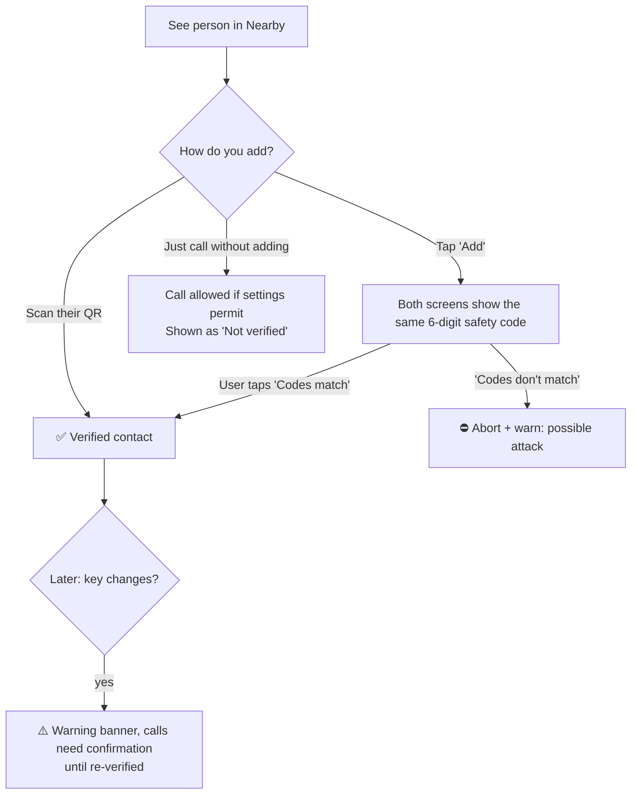

# 04 — Security & Privacy

## 1. Security goals

1. **Confidentiality:** only call participants can hear, see or read content. Not the router, not the network admin, not other Wi-Fi users.
2. **Authenticity:** you can know *cryptographically* who you're talking to, not just their display name.
3. **Integrity:** messages, media and files can't be modified undetected.
4. **Availability:** a malicious device on the LAN can't easily crash the app or ring your phone endlessly.
5. **Privacy:** minimal metadata exposure on the network. Zero data sent to the internet. No tracking.
6. **Safety:** no hidden recording, no silent auto-answer, and obvious indicators whenever mic/camera are live.

## 2. Threat model

| Adversary | Capability | Mitigation |
|---|---|---|
| **Passive Wi-Fi eavesdropper** (anyone on the network, network admin, compromised router) | Sniffs all packets | Noise (ChaCha20-Poly1305) for control/chat/files. DTLS-SRTP for media. Nothing is sent in plaintext except the mDNS announcement |
| **Active MITM** (ARP spoofing, rogue AP, mDNS spoofing) | Intercepts and relays connections | Mutual static-key authentication (Noise XX). SAS/QR verification of first contact. Key-change warnings. DTLS fingerprint bound to the Noise session |
| **Impersonator** | Sets same display name/avatar as a colleague | Identity = key, not name. Verified badge. Unverified strangers are labeled "Not verified". Name collisions show a fingerprint suffix |
| **Spammer / harasser on LAN** | Floods calls, knocks, messages | "Allow calls from" setting, block list, per-peer rate limits (see protocol §6), automatic quieting |
| **DoS attacker** | Malformed packets, connection floods, huge frames | Strict size caps checked *before* allocation, handshake rate limiting, connection caps, fuzzed parsers, timeouts on every state |
| **Malicious file sender** | Sends malware, path traversal names, huge files | Explicit accept, filename sanitization, no auto-open, size confirmation for large files, stored in app sandbox |
| **Device thief** (unlocked device) | Reads chats/recents | Relies on OS lock. Optional app lock (P2). DB encrypted at rest, key in OS keystore |
| **Curious app store / developer** | — | No servers, no telemetry, reproducible builds, open source |

**Out of scope:** a compromised operating system or malware with root/admin/accessibility privileges, RF jamming, physical shoulder surfing, and traffic analysis of *who talks to whom* by an attacker who can see IP flows. Metadata on a LAN is inherently visible; we minimize it but can't hide it.

## 3. Cryptography summary

| Purpose | Primitive | Library |
|---|---|---|
| Device identity | X25519 static keypair | libsodium (`crypto_box` keypair / `crypto_scalarmult`) |
| Channel | `Noise_XX_25519_ChaChaPoly_BLAKE2b` | Zoocall Noise state machine over libsodium primitives |
| Fingerprint | BLAKE2b-256 | libsodium `crypto_generichash` |
| SAS (safety code) | BLAKE2b over Noise handshake hash, 20 bits | libsodium |
| Media | DTLS-SRTP (AES-GCM), ECDSA P-256 certs | libwebrtc (BoringSSL) |
| File integrity | BLAKE2b-256 streaming | libsodium |
| DB at rest | SQLCipher 4 (AES-256) with a random raw key | `sqlcipher-android`, `sqlite-jdbc-crypt` |
| Attachments at rest | XChaCha20-Poly1305 per-file key | libsodium `secretstream` |
| Discovery tags (P2) | HMAC-SHA-256 truncated | libsodium `crypto_auth_hmacsha256` |
| Randomness | OS CSPRNG | libsodium `randombytes` |

**Library:** `com.ionspin.kotlin:multiplatform-crypto-libsodium-bindings`. It provides libsodium on Android, the desktop JVM (Windows, macOS, Linux) and iOS, so crypto code stays in `commonMain`. Phase 0 includes a spike to confirm it on all three v1 targets. Fallback: `lazysodium-android` / `lazysodium-java` behind the same interface.

**The one custom piece: the Noise state machine**
There is no maintained Kotlin Multiplatform Noise library, so Zoocall implements the Noise XX pattern (about 400 lines) directly from the Noise spec on top of libsodium. The mitigations:
- The code only composes audited primitives. No new cryptographic algorithms.
- It must pass the **official Noise test vectors** for `Noise_XX_25519_ChaChaPoly_BLAKE2b` in CI.
- Cross-implementation test: a Zoocall handshake must interoperate with a reference implementation (the Rust `snow` crate, run in a CI test container).
- It is fuzzed, requires two-person review for any change, and is the first item offered for external audit.

**Rules**
- No new crypto algorithms and no crypto negotiation beyond the protocol version, so there's nothing to downgrade.
- Private keys never leave the device and are never logged. Key byte arrays are wiped after use (`sodium_memzero`), knowing that the JVM can't guarantee complete erasure of copies.

## 4. Key storage per platform

| Platform | Identity private key & DB key |
|---|---|
| Android | Android Keystore (StrongBox if available) wraps the raw keys (AES-GCM). The wrapped blob lives in app-private storage, excluded from backup (`android:allowBackup="false"`, `dataExtractionRules`) |
| Windows | Encrypted with **DPAPI** (current user scope) via JNA `Crypt32Util`, stored under `%LOCALAPPDATA%\Zoocall` |
| macOS | **Keychain** (login keychain, this device only) via `java-keyring` or JNA to Security.framework |
| Linux (later) | Secret Service (GNOME Keyring / KWallet). If unavailable, the user sets an app passphrase (Argon2id via libsodium `crypto_pwhash`) |
| iOS (later) | Keychain, `kSecAttrAccessibleAfterFirstUnlockThisDeviceOnly` |

## 5. Trust & verification UX

- Verification is **encouraged, never forced**. The UI makes the verified state visible and the unverified state honest.
- Calling an unverified person is allowed (team usability), with a subtle "Not verified" label.
- A key change for a verified contact is **always** shown before a call connects.
- **Desktop QR:** the PC shows its QR on screen, and the phone scans it. The PC can't scan (most PCs have no rear camera), so PC ↔ PC adding uses the safety code.

## 6. Privacy by design

| Principle | Implementation |
|---|---|
| No internet | The app makes zero WAN connections. CI test: run the desktop app and CLI peer in a network namespace with only LAN routes and assert no WAN attempts. No Firebase/GMS dependencies on Android |
| No accounts, no identifiers | No phone number, email or device ID. Key is generated locally |
| Minimal broadcast | mDNS instance name is random. Name in TXT only when visibility = Everyone. "Hidden" mode advertises nothing. P2 "Contacts only" uses rotating tags |
| No telemetry | No analytics SDKs, no crash reporting services. Users can export a local diagnostics bundle (logs redacted of message content and keys) |
| Local logs | Rotating, max 5 MB, no message bodies, no SDP, IPs truncated in release builds |
| Camera/mic honesty | Media is only captured after the user accepts or starts a call. PTT only transmits while held. OS indicators (Android privacy dot, macOS menu bar indicator, Windows privacy icon) plus in-app indicators |
| Recording consent (P2) | All participants get a persistent banner + chime. Recording can't start silently |
| Data retention | User controls: clear recents, clear chats, disappearing messages (P2), "Delete everything" in settings |
| Backups | Excluded from OS cloud backups by default. Encrypted manual export only (P2) |
| Permissions | Minimal and just-in-time. The app is fully usable without the camera permission (audio only) |
| Desktop auto-update | **Disabled.** Update checks would contact the internet. Updates come through winget / Microsoft Store / Homebrew / manual download |

## 7. Abuse prevention

- **Allow calls from:** Everyone (default for small trusted networks) / Contacts / Favorites only.
- **Block:** instant, local. The blocked person gets "Unavailable".
- **Stranger mode:** non-contacts can't send files, and a message from a non-contact shows as a *request* first (accept/block).
- **Auto-quiet:** a non-contact who is declined 3× in 10 min is muted for 1 h.
- **Emergency override** (P3) works only for contacts you explicitly marked as trusted.

## 8. Secure development lifecycle

| Practice | Details |
|---|---|
| Parsing safety | All network input goes through Wire-generated decoders after a size check. No reflection-based deserialization of network data |
| Fuzzing | **Jazzer** (JVM fuzzing) targets: frame decoder, envelope decoder, Noise handshake messages, SDP sanitizer, filename sanitizer, mDNS TXT parser. Runs nightly in CI |
| Test vectors | Official Noise vectors + Zoocall vectors (fingerprint, SAS, frames) in `protocol/test-vectors/` |
| Dependencies | Gradle dependency verification (`verification-metadata.xml`), dependency locking, OWASP Dependency-Check / GitHub Dependabot alerts, Renovate for updates, CycloneDX SBOM per release |
| Static analysis | Detekt, Android Lint, ktlint, CodeQL (Kotlin) |
| Mobile standard | Align with **OWASP MASVS v2** (storage, crypto, network, platform, code, privacy) |
| Reviews | Two-person review for `shared/core/crypto`, `shared/core/transport`, `shared/core/protocol`, `protocol/` (CODEOWNERS) |
| Signed releases | Android APK signature scheme v3. Windows Authenticode via SignPath Foundation (free for OSS). macOS Developer ID signing + notarization (when the Apple account exists). Checksums + Sigstore/cosign signatures on GitHub Releases |
| Reproducible builds | Target F-Droid reproducible build for Android |
| Disclosure | `SECURITY.md` with private reporting via GitHub Security Advisories, 90-day disclosure policy |
| External audit | Before 1.0 stable, apply for a free audit (OSTIF, NLnet NGI, Radically Open Security). Scope: Noise implementation, transport, key storage |

## 9. Security acceptance checklist (release gate)

- [ ] All protocol test vectors pass (Noise official + Zoocall)
- [ ] Noise interop test against the reference implementation passes
- [ ] MITM test: ARP-spoof proxy in lab → safety code mismatch detected, and key-change warning appears
- [ ] Media binding test: substituted DTLS cert → call refuses to connect
- [ ] Fuzzers ran ≥ 24 h with no crashes since last release
- [ ] No WAN traffic in network-namespace test
- [ ] Logs contain no message content, keys or full SDP
- [ ] Backup exclusion verified on Android
- [ ] Rate limits verified with the CLI peer `--flood` test mode
