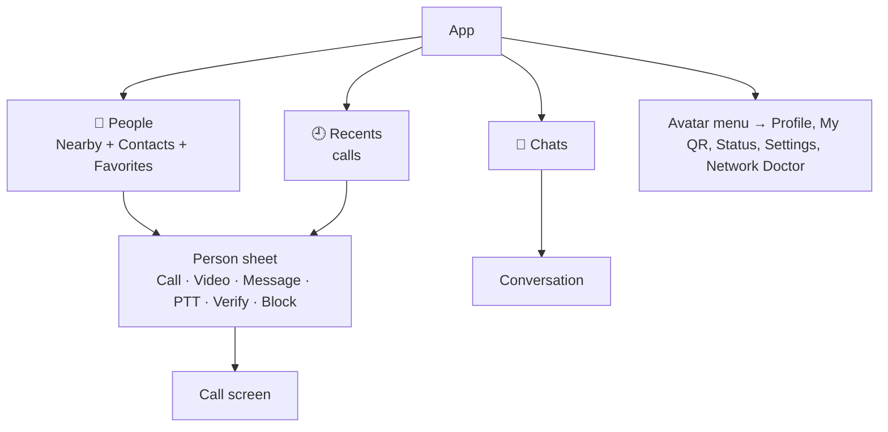

# 05 — UX / UI Design

## 1. Design philosophy

> **"Open. See your team. Tap to talk."**

- **Three taps maximum** to any core action: open app → tap person → tap call.
- **Calm, modern, focused.** Generous spacing, rounded shapes, soft depth, one accent color and no clutter.
- **One design system, adapted per form factor.** Android and Desktop share one Compose Multiplatform design system based on Material 3 Expressive. It adapts to phone, tablet and desktop (density, pointer, keyboard) and respects each OS's conventions for theme, accent, window chrome and shortcuts.
- **The call screen is sacred.** It is full-bleed, the controls are big and it has no distractions.
- **Honest states.** Always show what's happening: ringing, connecting, reconnecting, muted, not verified, recording.

## 2. Design systems per platform

| Platform | System | Platform adaptations | Type |
|---|---|---|---|
| Android | Material 3 Expressive, Material You dynamic color | Edge-to-edge, predictive back, CallStyle notifications, PiP | System font (Roboto Flex) |
| Windows | Same Zoocall design system, desktop density | Follows Windows light/dark + accent color, native title bar, system tray, `Ctrl` shortcuts, right-click menus | Segoe UI Variable (via system default) |
| macOS | Same Zoocall design system, desktop density | Follows macOS appearance + accent color, unified title bar, menu bar, `⌘` shortcuts | SF Pro (system) |
| iOS (later) | Decided at iOS phase: Compose Multiplatform iOS or SwiftUI with Apple HIG | — | SF Pro |
| Icons | **Material Symbols Rounded** (Apache-2.0) everywhere, plus a few custom pictograms (PTT, Knock) in `design/icons/` | | |
| Brand assets | `design/brand/` app icon in Android adaptive, Windows ICO and macOS ICNS formats | | |

**Design tokens** (`design/tokens/*.json`, W3C Design Tokens format) are generated into a Kotlin `ZoocallTheme` used by `shared/ui`. If iOS later uses SwiftUI, the same tokens generate Swift:
- Color roles: `primary`, `onPrimary`, `surface`, `surfaceContainer`, `accept` (green), `decline` (red), `warning`, `verified`, `live` (recording/mic-hot)
- Spacing scale 4/8/12/16/24/32, radii 8/12/16/28/full, motion durations 100/200/300/500 ms
- Brand seed color: **Zoocall Teal `#0F9D8A`**, with secondary Indigo for PTT. Final colors are tuned in design phase against contrast checks

## 3. Themes

- **System** (default), **Light**, **Dark**. The setting applies instantly with no restart.
- Android 12+: dynamic color from the wallpaper (toggle "Use Zoocall colors"). Windows and macOS: system accent color option.
- Dark theme uses tonal surfaces (not pure black) by default. **AMOLED black** is optional (P2).
- **Call screen is always dark** regardless of theme, for video legibility and less glare.
- High-contrast modes (Windows contrast themes, iOS Increase Contrast, Android high-contrast text) are fully respected.

## 4. Information architecture



### Navigation
- **Phones:** bottom navigation bar with **3 destinations**: *People · Chats · Recents*. Avatar in the top bar opens Profile & Settings.
- **Tablets / foldables / desktop:** navigation rail + **list-detail** two-pane layout (`NavigationSuiteScaffold` + `ListDetailPaneScaffold` from Material 3 adaptive, shared by Android and Desktop).
- **Predictive back** (Android), `Alt+←` / `Esc` (Windows), `⌘[` / `Esc` (macOS).
- **Desktop windows:** main window (list-detail) + a separate **call window** that can be resized, kept on top or moved to another monitor + a small always-on-top **incoming call window**.
- Badges: unread counts on Chats and missed calls on Recents.

## 5. Key screens

### 5.1 Onboarding (one screen + permission moments)
1. Welcome: logo, one line ("Call and chat with anyone on your Wi-Fi. No internet. No account."), name field, avatar picker (initials auto-generated), **Get started**.
2. Notifications permission (Android 13+/iOS) asked with context: "So you never miss a call."
3. Done. Land on **People**. Mic/camera/local network permissions are asked at the first moment of need.

### 5.2 People (home)
```
┌───────────────────────────────────────┐
│ (R) Zoocall        🟢 Available   ⋮   │  ← avatar = profile/settings, status chip
│ 🔍 Search people                      │
│ ─ Favorites ─────────────────────────│
│ (A) Anika · Front desk   ✓   📞  🎥   │  ← ✓ verified, one-tap call/video
│ ─ Nearby now (5) ────────────────────│
│ (T) Tanvir · Busy        ✓   📞  🎥   │
│ (J) Jamie   · Not verified   📞  🎥   │
│ ─ Offline contacts ──────────────────│
│ (S) Sara · last seen 2h ago           │
│                                       │
│      [ 📷 Add by QR ]                 │  ← extended FAB on mobile
├───────────────────────────────────────┤
│  👥 People     💬 Chats    🕘 Recents │
└───────────────────────────────────────┘
```
- Presence dot + text (never color alone).
- **Empty state:** illustration + "No one nearby yet. Make sure others have Zoocall open on the same Wi-Fi." + buttons **Show my QR** and **Run Network Doctor**.
- Long-press/right-click person: Favorite, Knock, Push-to-talk, Verify, Block.

### 5.3 Incoming call
- Full screen, blurred avatar background, large name, role, **verified badge or "Not verified"**, call type.
- Actions: **Decline** (red), **Accept** (green), **Accept audio-only** (for video), **Message** (quick replies).
- On Android lock screen the system UI is used (CallStyle notification + full-screen intent). On desktop a compact always-on-top incoming call window appears in the corner of the screen with a ringtone, even when Zoocall is minimized to the tray.
- Ringtone respects silent/DND modes. Flash-screen alert is optional for accessibility.

### 5.4 In-call (video)
```
┌───────────────────────────────────────┐
│ ‹  Anika  ✓   00:42   ▂▄▆ HD     ⓘ   │  ← auto-hides after 4 s
│                                       │
│          [ remote video full ]        │
│                          ┌───────┐    │
│                          │ self  │    │  ← draggable, snaps to corners
│                          └───────┘    │
│                                       │
│   🎙️     🎥     🔊     🔄     ⋯     ⛔   │  ← mute, camera, audio route,
└───────────────────────────────────────┘      flip, more, END (largest, red)
```
- "More" sheet: Share screen, Add people, Captions (P2), Blur (P2), Call info/stats, Switch to audio.
- Tap video to show/hide controls. Double-tap to swap self/remote.
- Status toasts: "Anika muted", "Reconnecting…", "Poor connection, video paused".
- **Audio call** layout: large avatar, animated speaking ring, same control bar + keypad-free.
- **Group grid:** 1 = full, 2 = split, 3–4 = 2×2, audio-only participants as avatar tiles with speaking ring.
- **PiP:** automatic on Home/app switch during video.

### 5.5 Chats & conversation
- Standard, familiar messenger layout: bubbles, day separators, delivery ticks, reply swipe, long-press reactions.
- Composer: text field, attach (📎), voice-note hold-to-record (🎙️), send.
- Header: name + presence, 📞 🎥 actions.
- A banner shows when the peer is offline: "Anika is offline. Messages will be delivered when Anika is back on the network." (Copy repeats the name and never guesses pronouns.)

### 5.6 Push-to-talk (P1)
- A large circular **Hold to talk** button (also Space bar on desktop, hardware volume key option on Android).
- Clear states: *Idle*, *You're talking* (pulsing live ring + haptic), *Anika is talking* (her avatar highlighted), *Busy channel*.
- A start/stop chirp sound is played for audio feedback.

### 5.7 Network Doctor (P1)
Checklist with live results and plain fixes:
- ✅ Connected to Wi-Fi "Office-5G"
- ✅ Local network permission granted
- ⚠️ VPN is active: *"Your VPN may hide other devices. Allow LAN access in your VPN settings."*
- ❌ Discovery blocked: *"This network may block device discovery (common on guest Wi-Fi). Use QR code or ask IT to disable client isolation."*
- ✅ Firewall allows Zoocall (desktop)
- Your address: `192.168.1.24:47474` · [Show my QR]

### 5.8 Settings (grouped, one level deep where possible)
Profile · Appearance (theme, color) · Privacy & Security (visibility, allow calls from, blocked, app lock, verify my code) · Calls (ringtone, video quality, noise suppression, PTT) · Chats (receipts, typing, media auto-accept size) · Notifications · Accessibility (captions, flash alert, haptics) · Storage & Data (clear, export) · Language · Network Doctor · About (version, licenses, source code link, security policy).

## 6. Motion & feedback

- Material 3 Expressive motion (spring-based) on Android and Desktop. Durations 150–300 ms and no gratuitous animation.
- Meaningful motion only: the incoming call ring pulse, a speaking indicator and state transitions.
- **Reduce Motion** replaces movement with fades.
- **Haptics:** light tick on mute toggle, strong on call connect/end, continuous pattern for incoming ring (respecting system settings).
- **Sounds:** outgoing ringback, connect chime, end tone, PTT chirps, message sound. All sounds are original or CC0, stored in `design/sounds/`.

## 7. Accessibility requirements (WCAG 2.2 AA + platform guidelines)

| Area | Requirement |
|---|---|
| Screen readers | Every control labeled ("Mute microphone, currently on"). Call state changes announced via live regions / accessibility announcements. Logical focus order |
| Text scaling | Layouts tested at 200% / largest accessibility sizes. Nothing truncates critical info |
| Targets | ≥ 48×48 dp / 44×44 pt. End-call ≥ 64 dp |
| Contrast | Tokens validated automatically (text ≥ 4.5:1, icons/UI ≥ 3:1) in both themes |
| Keyboard (desktop) | Full operation with visible focus. Shortcuts (`⌘` instead of `Ctrl` on macOS): `Ctrl+Shift+M` mute, `Ctrl+Shift+V` camera, `Ctrl+Enter` accept, `Ctrl+Shift+E` end, `Space` PTT (when focused) |
| Desktop screen readers | Compose semantics mapped to Windows UI Automation (Narrator, NVDA) and macOS accessibility (VoiceOver). Verified manually each release because desktop Compose accessibility is less mature than Android's |
| Non-color cues | Icons + text for presence, verification, errors |
| Hearing | Captions (P2), visual ring/flash alerts, vibration patterns |
| Motor | No time-critical gestures required. Accept/decline via buttons, not only swipes |
| Cognitive | Plain language (grade ~6 reading level), consistent placement, undo for destructive actions |

## 8. UX writing rules

- Talk like a helpful colleague: "Anika is busy" not "Error 486".
- Never blame the user. Always say what to do next.
- Button labels are verbs: *Call*, *Accept*, *Decline*, *Verify*.
- Security copy is calm and specific: "Anika's security code changed. This happens when Zoocall is reinstalled. Verify before sharing anything sensitive."
- All strings are externalized from day one. English is the source and Bengali the first translation. Community translations go through Weblate (hosted free for libre projects).

## 9. Design process & deliverables

1. **Low-fi flows** for the main journeys: onboarding, call, incoming, chat, add+verify, PTT, Network Doctor.
2. **Hi-fi mockups** in **Penpot** (open source, files committed to `design/mockups/`) or Figma with exported PDFs. Light, dark, large text and RTL variants.
3. **Token pipeline** set up before the first screen is coded.
4. **Usability test** with 5 non-technical people per major milestone (task: "Call your colleague", "Verify a contact").
5. Screenshot tests lock in visual regressions (see [08-engineering-quality.md](08-engineering-quality.md)).
6. Every screen is designed in three widths: **phone** (< 600 dp), **tablet** (600–840 dp) and **desktop window** (> 840 dp).
