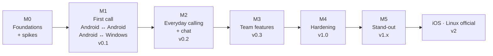

# 09 — Roadmap

Milestones are **scope-based with exit criteria**, not date-based. Each ends with a usable, tagged release.

**Rev. 2 focus:** Android and Desktop (Windows + macOS) are built **together** from one Kotlin codebase. The owner tests **Android ↔ Android** and **Android ↔ PC**. iOS and official Linux support come after v1.0.

---

> **Progress (2026-09-13):** Gradle monorepo, protocol schema + spec, Noise XX (official vectors pass), transport, discovery, 1:1 call state machine + signaling, chat, encrypted store, shared UI, Android shell and desktop shell are implemented. JVM tests pass; real-device testing (Android ↔ Android first) is next. Implementation decisions: [docs/adr/0001](adr/0001-m1-implementation-choices.md).
>
> **Progress (2026-09-14, M2 in progress):** core for replies, reactions, delete-for-me, message search, photos & files (hash-verified, resumable, FILE connections), custom status, message requests, decline with quick message, call waiting, hold and audio → video upgrade with consent is implemented and covered by JVM tests. Desktop call stats now include codecs and bitrates. The shared UI for all of these, Android picture-in-picture and file sharing, desktop file dialogs, start at login (`--background`) and the in-app Windows Firewall helper are implemented; device testing is next. Decisions: [docs/adr/0002](adr/0002-m2-implementation-choices.md).

> **Progress (2026-09-14, M3 in progress):** Android ↔ Android and Android ↔ Windows calls, chat, voice notes and files verified on devices. Desktop audio/video device selection with hot-plug. Network Doctor (checks, plain fixes, Windows profile/firewall and Android battery fixes) and Knock (live nudge with one-tap replies, Android notification actions, desktop tray notifications) are implemented with JVM tests. Decisions: [docs/adr/0003](adr/0003-m3-implementation-choices.md).

> **Progress (2026-09-14, M4 + M5 code complete):** M3 is complete; the M4 code items (encrypted attachments at rest, Bengali/RTL, localized desktop shell) are done ([ADR 0004](adr/0004-m4-implementation-choices.md)); all ten M5 stand-out features are implemented and covered by JVM tests where they have logic ([ADR 0005](adr/0005-m5-implementation-choices.md)). Next: device testing of M3–M5 (group calls, linked devices and transfer need three devices), then the M4 items that need people, devices or accounts: accessibility pass, Android performance budgets, fuzzing, guides, signing and distribution.

## M0 — Foundations + technical spikes

**Goal:** a working build on the Windows dev PC and proof that the risky libraries work.

Setup
- [ ] Windows dev environment ready ([11-dev-environment-windows.md](11-dev-environment-windows.md))
- [ ] Gradle monorepo skeleton: `shared/core/*`, `shared/media`, `shared/ui`, `android`, `desktop`, `tools/cli`
- [ ] `.gitattributes`, `.editorconfig`, CONTRIBUTING, SECURITY, CODE_OF_CONDUCT, CODEOWNERS
- [ ] CI: `ci-shared.yml`, `android.yml`, `desktop.yml` (Windows + macOS runners)
- [ ] `protocol/proto/zoocall/v1` schemas + Wire code generation
- [ ] Design: brand seed color, app icon draft, tokens → Kotlin theme, light/dark
- [ ] Hi-fi mockups (phone + desktop): onboarding, People, incoming call, in-call, chat, add + verify

Spikes (each is a small throwaway test that proves a risky part works)
- [ ] **Crypto:** libsodium KMP loads and works on Android, Windows and macOS (CI). Noise XX passes official test vectors
- [ ] **Discovery:** Android `NsdManager` ↔ Desktop `JmDNS` see each other on a real Wi-Fi network
- [ ] **Media:** Android libwebrtc ↔ Windows webrtc-java audio + video call with manually exchanged SDP on LAN
- [ ] **Storage:** SQLDelight + SQLCipher works on Android and desktop JVM
- [ ] **CLI milestone:** two CLI peers (Windows PC + another machine or container) discover each other, verify SAS and chat over Noise

**Exit:** all spikes green (or a fallback chosen and documented as an ADR), CI green on Windows + macOS + Linux runners, mockups approved.

## M1 — First call (v0.1 alpha)

**Goal:** Android ↔ Android and Android ↔ Windows 1:1 calls that feel finished. macOS builds in CI.

Core
- [ ] Identity + key storage (Android Keystore, DPAPI, Keychain)
- [ ] Transport: listener, Noise handshake, framing, keepalive, reconnection, rate limits
- [ ] Discovery + manual IP
- [ ] Call state machine (1:1), signaling, collision, timeouts, DTLS fingerprint binding
- [ ] Storage: profile, contacts, calls

App (Android + Desktop, shared UI)
- [ ] Onboarding (name + avatar)
- [ ] People: nearby + contacts, search
- [ ] Add contact with **safety code** and **QR** (phone scans PC's QR or another phone's QR)
- [ ] 1:1 **audio** and **video** call: mute, camera on/off, flip camera (phone), device selection (PC), audio routing (phone), proximity
- [ ] **Incoming call**: Android Core-Telecom + full-screen notification. Desktop tray + always-on-top incoming call window + ringtone
- [ ] Missed calls + Recents
- [ ] Theme: System/Light/Dark, dynamic color on Android
- [ ] Accessibility pass on the call flow

Release
- [ ] APK on GitHub Releases, Windows MSI + macOS DMG (unsigned) on GitHub Releases

**Exit:** owner makes Android ↔ Android and Android ↔ Windows audio + video calls on home Wi-Fi. Call setup < 1 s. No WAN traffic. Five non-technical testers make a call within 60 s without help.

## M2 — Everyday calling + chat (v0.2 beta)

- [ ] 1:1 **text chat** with offline outbox, delivery/read receipts, typing indicator
- [ ] Replies, reactions, message search
- [ ] **Photos & files** with progress, pause/resume, hash verification
- [ ] Presence: Available / Busy / DND / Away, custom status, auto-busy in call
- [ ] Decline with quick message, call waiting / hold
- [ ] Audio → video upgrade with consent
- [ ] **Reconnecting** after Wi-Fi blips (ICE restart), quality indicator, call stats panel
- [ ] Picture-in-Picture (Android), separate resizable call window (Desktop)
- [ ] "Stay reachable" foreground mode (Android), start at login + tray (Desktop)
- [ ] Favorites, block list, "Allow calls from", stranger requests
- [x] Windows firewall rule in installer — replaced by the in-app firewall helper and Network Doctor fix, since a per-user MSI can't add rules (ADR 0002 #13)

**Exit:** a small team (≥ 5 devices, mixed Android + Windows) uses Zoocall for a week of daily calls and chat.

## M3 — Team features (v0.3 beta)

- [x] **Group calls:** audio ≤ 8, video ≤ 4, add people mid-call
- [x] **Push-to-talk** (1:1 and group), including desktop `Space` hotkey
- [x] **Knock** with one-tap replies
- [x] **Voice notes**
- [x] **Screen sharing** from Desktop (receive on Android and Desktop)
- [x] **Network Doctor** (Wi-Fi, VPN, multicast, client isolation, Windows Public profile, firewall, virtual adapters)
- [x] Flash alert for incoming calls (accessibility), ringtones & sounds settings
- [x] Global mute hotkey (Desktop)

**Exit:** interop matrix (Android, Windows, macOS) green for all features. Group call with 3 phones + 1 PC works.

## M4 — Hardening (v1.0 stable)

- [x] Encrypted attachments at rest
- [x] Bengali translation, RTL verified, strings complete
- [ ] Full accessibility pass: TalkBack, Narrator/NVDA, VoiceOver, 200 % font scale
- [ ] Performance budgets met (startup, CPU, battery, installer size)
- [ ] Security: fuzzing ≥ 24 h clean, MITM lab test, Noise interop test, external audit request
- [ ] Docs: user guide, IT admin guide, protocol spec 1.0 frozen
- [ ] Signing: Android release key, Windows Authenticode (SignPath), macOS notarization if Apple account available
- [ ] Distribution: GitHub Releases, F-Droid, Google Play, winget, Microsoft Store

**Exit:** security + accessibility + interop checklists pass. Protocol v1 frozen.

## M5 — Stand-out features (v1.x)

Ordered by value / effort. Each ships independently behind capabilities.

1. ✅ Contact groups + broadcast announcements ([ADR 0005](adr/0005-m5-implementation-choices.md))
2. ✅ Private discovery ("Contacts only" with rotating tags)
3. ✅ On-device **live captions** (system captioning, ADR 0005 #4)
4. ✅ ML noise suppression + background blur (strong NS on desktop + OS effects, ADR 0005 #5)
5. ✅ Linked devices (ring phone + PC together, ADR 0005 #6)
6. ✅ Desk intercom mode (desktop, opt-in, ADR 0005 #7)
7. ✅ Encrypted export/import, app lock, disappearing messages (ADR 0005 #8–10)
8. ✅ Small group chats (≤ 32, ADR 0005 #11)
9. ✅ Screen sharing from Android (MediaProjection, ADR 0005 #12)
10. ✅ Call recording with consent, call transfer (ADR 0005 #13–14)

## v2 — New platforms

- **Linux official:** packaging (DEB/RPM/Flatpak), PipeWire and Wayland screen share verification
- **iOS / iPadOS:** KMP core on iOS, UI decision, CallKit, WebRTC.xcframework, Apple entitlements (apply months ahead)

## Future (only if it stays simple)

- LAN host relay (SFU) for bigger meetings
- Wi-Fi Direct / Wi-Fi Aware calling with no router
- Wear OS quick answer + PTT
- On-device caption translation
- Emergency alert broadcast

---

## Definition of Done (every feature)

- [ ] Works on **Android and Desktop** (shared code), tested Android ↔ Android and Android ↔ Windows
- [ ] Works against the `tools/cli` peer in automated tests
- [ ] Capability-gated if it needs protocol support
- [ ] Phone, tablet and desktop layouts. Light/dark, large text, RTL screenshots updated
- [ ] Screen reader labels + announcements verified
- [ ] Strings externalized
- [ ] Edge cases from [07-edge-cases.md](07-edge-cases.md) covered by tests or documented
- [ ] Docs updated
- [ ] No new WAN traffic, no new permissions without plan update
